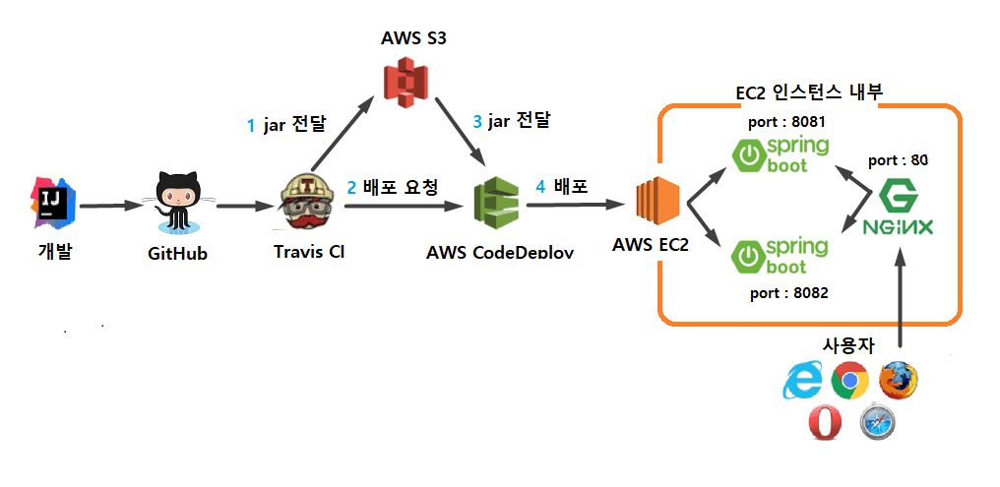

# 배포 자동화
작업 흐름을 정리하면 다음과 같음.
- 코드 버전 관리를 하는 vcs 시스템에 code push 
- 자동으로 테스트와 빌드가 수행
- 안정적인 배포 파일 생성
- 배포 된 파일을 운영 서버에 서비스 중단 없이 배포

## 전체 그림


## CI 를 위한 작업
1. travis ci github 계정으로 가입 후
2. ci 로 관리할 프로젝트 설정. 
ci 설정은 ```.travis.yml``` 파일로 한다.
아래는 예시.
```
language: java
jdk:
  - openjdk8

branches:
  only:
    - master

# Travis CI 서버의 Home
cache:
  directories:
    - '$HOME/.m2/repository'
    - '$HOME/.gradle'

# git 으로 push 된 프로젝트를 자동으로 빌드시킴.
script: "./gradlew clean build"

before_deploy:
  - mkdir -p before-deploy # zip에 포함시킬 파일들을 담을 디렉토리 생성
  - cp scripts/*.sh before-deploy/
  - cp appspec.yml before-deploy/
  - cp build/libs/*.jar before-deploy/
  - cd before-deploy && zip -r before-deploy * # before-deploy로 이동후 전체 압축
  - cd ../ && mkdir -p deploy # 상위 디렉토리로 이동후 deploy 디렉토리 생성
  - mv before-deploy/before-deploy.zip deploy/freelec-springboot2-webservice.zip # deploy로 zip파일 이동

deploy:
  - provider: s3
    access_key_id: $AWS_ACCESS_KEY # Travis repo settings에 설정된 값
    secret_access_key: $AWS_SECRET_KEY # Travis repo settings에 설정된 값
    bucket: freelec-springboot-build # S3 버킷
    region: ap-northeast-2
    skip_cleanup: true
    acl: private # zip 파일 접근을 private으로
    local_dir: deploy # before_deploy에서 생성한 디렉토리
    wait-until-deployed: true

  - provider: codedeploy
    access_key_id: $AWS_ACCESS_KEY # Travis repo settings에 설정된 값
    secret_access_key: $AWS_SECRET_KEY # Travis repo settings에 설정된 값
    bucket: freelec-springboot-build # S3 버킷
    key: freelec-springboot2-webservice.zip # 빌드 파일을 압축해서 전달
    bundle_type: zip
    application: freelec-springboot2-webservice # 웹 콘솔에서 등록한 CodeDeploy 어플리케이션
    deployment_group: freelec-springboot2-webservice-group # 웹 콘솔에서 등록한 CodeDeploy 배포 그룹
    region: ap-northeast-2
    wait-until-deployed: true

# CI 실행 완료시 메일로 알람
notifications:
  email:
    recipients:
      - jojoldu@gmail.com
```
3. 빌드된 jar 파일을 s3에 전달하기 위해서, s3 설정.
4. aws key 발급(s3 접근 허용, codedeploy 접근 허용)
5. 발급 받은 키를 travis ci 에 등록($AWS_ACCESS_KEY, $AWS_SECRET_KEY)
6. s3 버킷 설정. (```deploy: provider: s3``` 부분)
7. iam 설정(ec2 가 code deploy 에 접근할 수 있도록 하는 권한 설정)
8. ec2 에 code deploy agent 설치.
9. code deploy 를 위한 권한 생성. (aws 는 각 서비스에서 다른 서비스에 접근할때 필요한 권한을 생성해야 함. )
10. aws 에서 code deploy 앱 생성.
11. code deploy 설정 (```appsec.yml```)
```
version: 0.0
os: linux
files:
  - source:  /
    destination: /home/ec2-user/app/step3/zip/
    overwrite: yes

permissions:
  - object: /
    pattern: "**"
    owner: ec2-user
    group: ec2-user

hooks:
  AfterInstall:
    - location: stop.sh # 엔진엑스와 연결되어 있지 않은 스프링 부트를 종료합니다.
      timeout: 60
      runas: ec2-user
  ApplicationStart:
    - location: start.sh # 엔진엑스와 연결되어 있지 않은 Port로 새 버전의 스프링 부트를 시작합니다.
      timeout: 60
      runas: ec2-user
  ValidateService:
    - location: health.sh # 새 스프링 부트가 정상적으로 실행됐는지 확인 합니다.
      timeout: 60
      runas: ec2-user
```
travis ci 에서 빌드가 완료되고 나 이후에 s3 에 빌드된 artifact 를 전달후, 해당 아티펙트를 ec2 에 배포해달라고, code deploy 에 요청함.
12. 배포단계별로 추가 작업을 하고 싶으면, ```hooks``` 섹션에 각 단계별 실행하고 싶은 작업의 내용을 스크립트로 작성해 등록해 놓는다.
[예를 들면,](https://docs.aws.amazon.com/codedeploy/latest/userguide/reference-appspec-file-structure-hooks.html)
code deploy 가 배포를 할때 거치는 5단계가 있는데,(Start > Install > AllowTestTraffic > AllowTraffic > End) 각 단계의 전후로 hook을 설정할 수 있다.
```
BeforeInstall – Use to run tasks before the replacement task set is created. One target group is associated with the original task set. If an optional test listener is specified, it is associated with the original task set. A rollback is not possible at this point.

AfterInstall – Use to run tasks after the replacement task set is created and one of the target groups is associated with it. If an optional test listener is specified, it is associated with the original task set. The results of a hook function at this lifecycle event can trigger a rollback.

AfterAllowTestTraffic – Use to run tasks after the test listener serves traffic to the replacement task set. The results of a hook function at this point can trigger a rollback.

BeforeAllowTraffic – Use to run tasks after the second target group is associated with the replacement task set, but before traffic is shifted to the replacement task set. The results of a hook function at this lifecycle event can trigger a rollback.

AfterAllowTraffic – Use to run tasks after the second target group serves traffic to the replacement task set. The results of a hook function at this lifecycle event can trigger a rollback.
```


e


